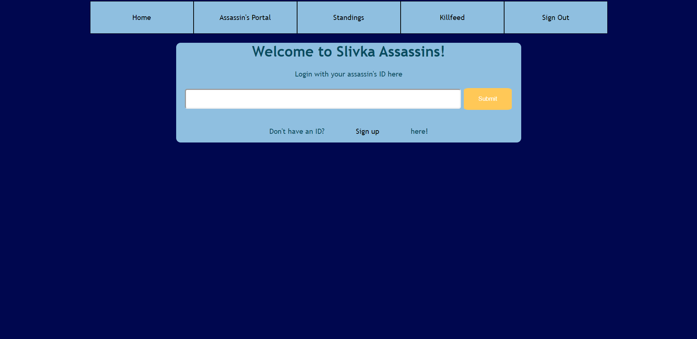
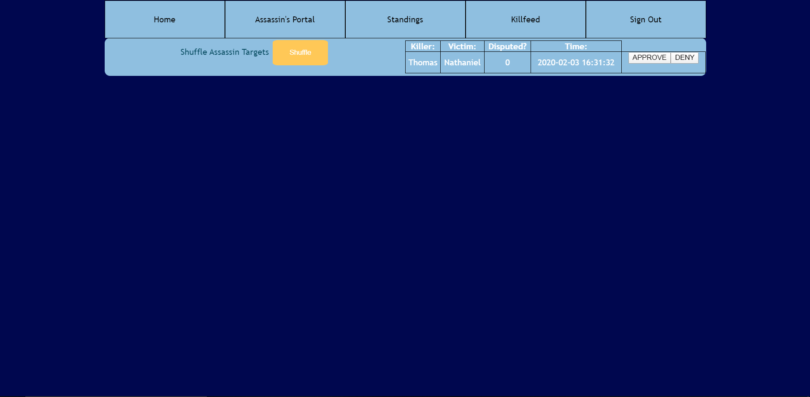
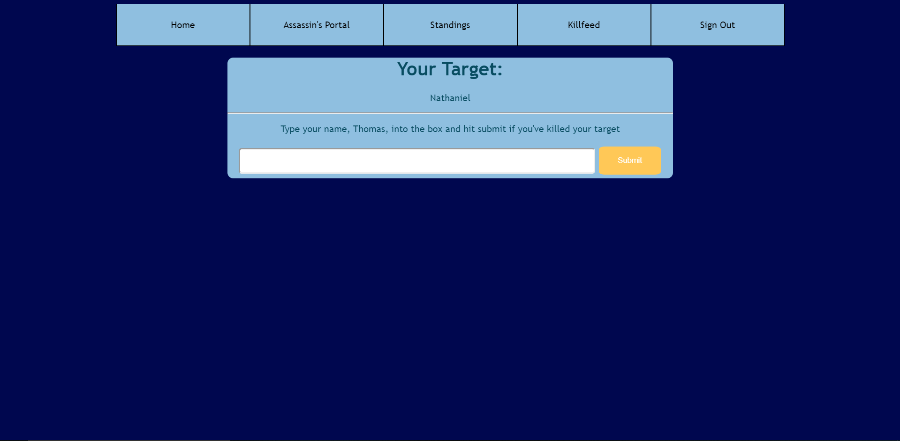
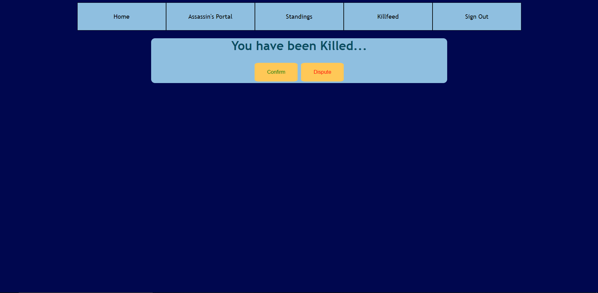

# AssassinWebApp
A server application written in PHP and MySQL to facilitate the running of an "assassin" game
## Requirements
1. A web server with PHP installed
2. A MySQL database
## Setup
First, change the parameters in sql_creds.txt
. The first line is sql server address
. The second line is username
. The third line is password
. The fourth line is the name of the database you want to store the information on

Then, change the admin password in admin_password.txt
This is the ID that the admin (who cannot play) will log in with on the main page to give them access to the admin page
If you leave this file empty, then anyone will be able to access the page (which could be useful for debugging purposes)

When users go to the website for the first time, they are prompted to sign in/ sign up.

Once they sign up, they will be given a 10 digit unique identifier. There are no passwords, this ID is all you need to sign in, so don't share it!
Once all the users have signed up, the host of the game can go to the /admin page and start the game by hitting the "shuffle targets" button.

## Gameplay
Now, when users go to their Assassin's Portal page, they are presented with their target.

When they've completed their task, they type their name into the field as a 'signature' and submit the kill request.

Now, when the victim logs in, they will be locked out of their portal and presented with this screen:

If they believe assassination was valid, they can confirm it, which will remove them from the game and give their killer the victim's target.
If they want to dispute the assassination, they can click the dispute button, which will temporarily give them access to their portal, but will show up on the admin page for the leader of the game to review.

The admin can then choose to confirm or remove the kill request depending on their discretion.

## Conclusion
And that's basically it. Happy playing!
